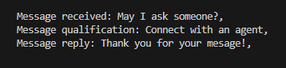
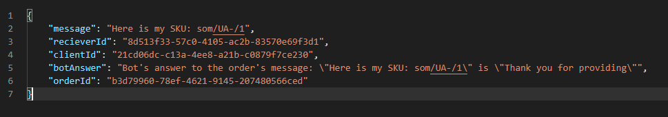
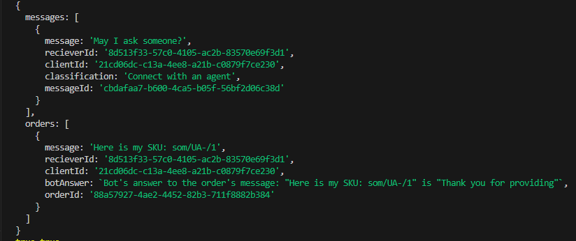

## Set Up Description

Postman collection is included to the project. So you can import it.

To initialize the project:

- copy `.env.example` to `.env` and fill the variables
- npm i
- npm run start

## Project description

There are 2 routs:

- classify
- order

### POST `/webhook/classify` - send a message and get classified message as a returned string

## 

### POST `/webhooc/order` - send a order message ( a message with the sku) to confirm your order

## 

### The DB structure

- DB is just a simple const variable.

## 
